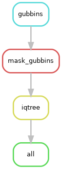

# phylokit
Snakemake pipeline to generate a phylogenetic tree from a multiple sequence alignment 

## Summary
This pipeline should be run on the alignment file as soon as it is available after running [SNPkit](https://github.com/Snitkin-Lab-Umich/snpkit).

In short, it performs the following steps:
- [Gubbins](https://github.com/nickjcroucher/gubbins) (v3.3.5) is used to detect and mask regions of recombination in the whole genome alignment. It idenitfies regions with elevated substitution densities indicative of recombination and masks them with 'N' characters to avoid misleading phylogenetic inference.
- [snp-sites](https://sanger-pathogens.github.io/snp-sites/) (v2.5.1) is then run on the Gubbins masked alignment to extract only the variable (SNP) sites. This produces a compact alignment of only SNP positions and focuses the phylogenetic analysis on informative sites. 
- [iqtree](http://www.iqtree.org/) (v2.4.0) takes the resulting SNP alignment and builds a maximum likelihood phylogenetic tree.


The workflow generates all the output in the output prefix folder set in the config file (instructions on setup found below). Each workflow steps gets its own individual folder as shown:

```
results/2025-04-25_Project_MDHHS_phylokit/
├── gubbins
├── gubbins_masked
└── IQtree
```

## Setup config and cluster files

**_If you are just testing this pipeline, the config file is already loaded with test data, so you do not need to make any additional changes to them. However, it is a good idea to change the run (name of your output folder) and prefix in the config file to give you an idea of what variables need to be modified when running your alignment on phylokit._**

### Config
As an input, the snakemake file takes a config file where you can set the path to your alignment file, define the name of your output results folder and prefix of files etc. Instructions on how to modify `config.yaml` is found in `config/`. 

### Cluster file
In `config/cluster.json`, change `email` to your email. 

Increase the `walltime` as necessary in `config/cluster.json`, however, keep in mind that asking for too high of a job run time will have the job pending for a while so ensure the jobs are being submitted in a timely manner. 


## Installation
> If you are using Great Lakes HPC, ensure you are cloning the repository in your scratch directory. Change `your_uniqname` to your uniqname. 

```

cd /scratch/esnitkin_root/esnitkin1/your_uniqname/

```

> Clone the github directory onto your system. 
```
git clone https://github.com/Snitkin-Lab-Umich/phylokit.git
```

> Ensure you have successfully cloned phylokit. Type `ls` and you should see the newly created directory **_phylokit_**. Move to the newly created directory.

```

cd phylokit

```

> Load Bioinformatics, snakemake, singularity and mamba modules from Great Lakes modules.

```

module load Bioinformatics snakemake singularity mamba

```

This workflow makes use of singularity containers available through [State Public Health Bioinformatics group](https://github.com/StaPH-B/docker-builds). If you are working on Great Lakes (umich cluster)—you can load snakemake and singularity modules as shown above. However, if you are running it on your local or other computing platform, ensure you have snakemake, singularity and mamba installed.


## Quick start

### Run phylokit on a set of samples.

> Preview the steps in phylokit by performing a dryrun of the pipeline. 

```

snakemake -s workflow/phylokit.smk --dryrun 

```

>Run phylokit on Great lakes HPC (You will copy paste the command on the terminal directly—your terminal window will be busy and cannot be used. You would have to open to a new tab to work on the terminal). 

```
snakemake -s workflow/phylokit.smk --use-conda  --use-singularity -j 999 --cluster "sbatch -A {cluster.account} -p {cluster.partition} -N {cluster.nodes}  -t {cluster.walltime} -c {cluster.procs} --mem-per-cpu {cluster.pmem}  --output=slurm_out/slurm-%j.out" --conda-frontend mamba --cluster-config config/cluster.json --configfile config/config.yaml --latency-wait 1000
```

> Submit phylokit as a batch job on Great Lakes. 

Change these `SBATCH` commands: `--job-name` to a more descriptive name like run_phylokit, `--mail-user` to your email address, `--time` depending on the number of samples you have (should be more than what you specified in `cluster.json`). Feel free to make changes to the other flags if you are comfortable doing so. Once you have made the necessary changes, save the below script as `phylokit.sbat`. Don't forget to submit phylokit to Slurm! `sbatch phylokit.sbat`.

```
#!/bin/bash

#SBATCH --job-name=phylokit
#SBATCH --mail-user=youremail@umich.edu
#SBATCH --mail-type=BEGIN,FAIL,END,REQUEUE
#SBATCH --export=ALL
#SBATCH --partition=standard
#SBATCH --account=esnitkin1
#SBATCH --nodes=1 --ntasks=1 --cpus-per-task=1 --mem=10g --time=24:15:00

## Note: Chang the mail-user, account, and SBATCH mem/time requirements as you see fit

# load modules
module load snakemake singularity mamba

# run snakemake
snakemake -s phylokit.smk --use-conda  --use-singularity -j 999 --cluster "sbatch -A {cluster.account} -p {cluster.partition} -N {cluster.nodes}  -t {cluster.walltime} -c {cluster.procs} --mem-per-cpu {cluster.pmem}  --output=slurm_out/slurm-%j.out" --conda-frontend mamba --cluster-config config/cluster.json --configfile config/config.yaml --latency-wait 1000

```





## Dependencies

### Near Essential
* [Snakemake>=7.32.4](https://snakemake.readthedocs.io/en/stable/#)

### Tool stack used in workflow

* [Gubbins](https://github.com/nickjcroucher/gubbins/blob/master/docs/gubbins_manual.md)
* [IQTree](http://www.iqtree.org/)
* [snp-sites](https://sanger-pathogens.github.io/snp-sites/)


